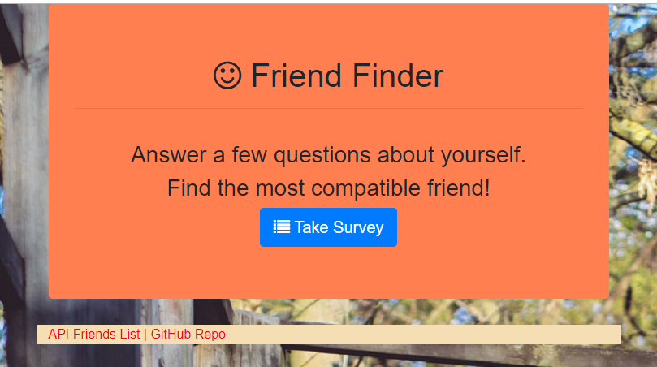
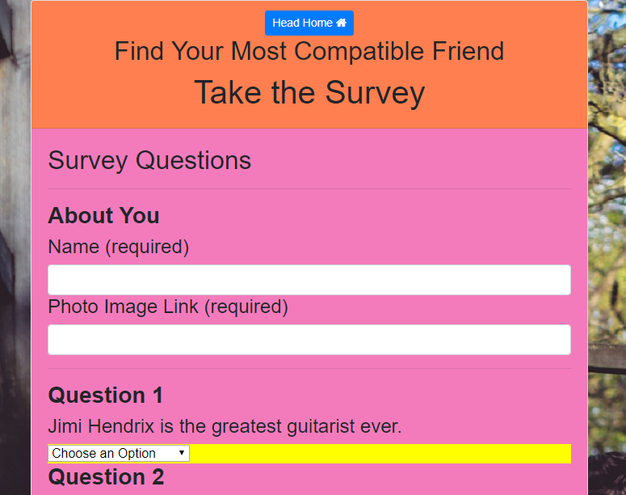
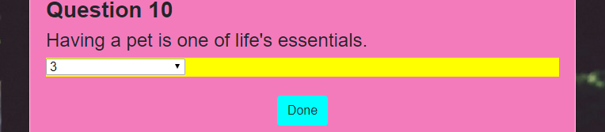
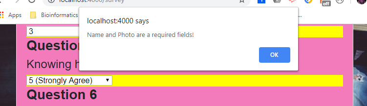
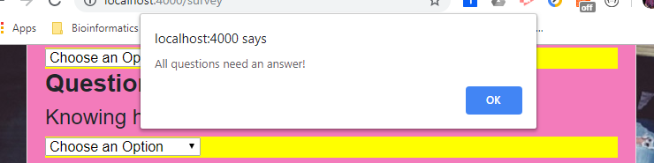
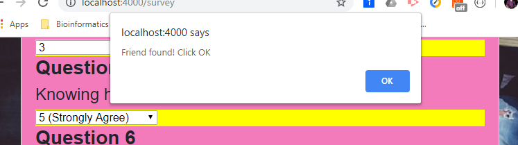
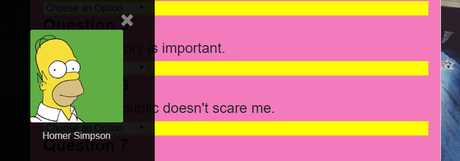
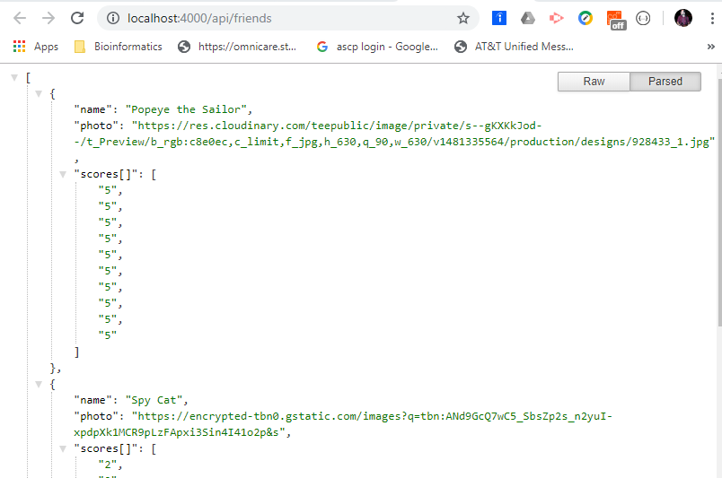

## Friend-Finder

#### Friend-Finder is an app that takes answers given by the user and finds their most compatible friend by comparing their answers to those that are in the database. The app finds the first friend that whose answers are closest to the user and display the friends name and photo. The app uses node.js, javascript, html, css, and bootstrap technologies.

#### When the user arrives at the website, the welcome page is presented.

#### After clicking on the 'Take Survey' button, the user is taken to the survey page.

#### The user is required to enter their name, an url for their photo, and to answer all ten of the questions. When all the required information is entered, the user hits the 'Done' button.

#### If the user fails to enter any of the fields, a prompt is shown and the user may return to enter the needed field.

#### When the 'Done button is clicked, the calculation is performed in the background and an alert is shown.

#### After this alert is clicked, the name and image of the most compatible friend is shown in a modal. The modal can be closed by clicking on the 'x' in the upper right hand corner. At this time all the fields are cleared and a new data can be entered and processed.

#### The links at the bottom of the page lead to the Github repository for the project and the json repository of friends used.

#### The app was created by a sole contributor which is myself.

